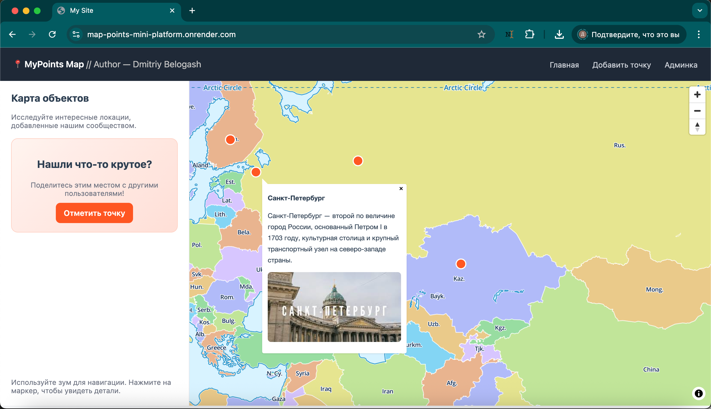
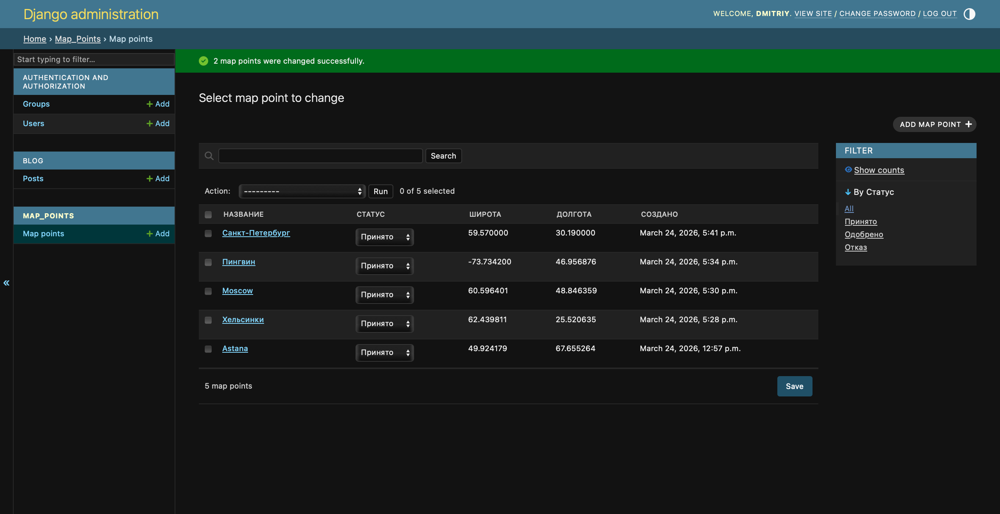

# Map Points Mini Platform — Interactive Map & Content System

Explore, add, and manage location-based content on an interactive map.  
This project is built with [Django](https://www.djangoproject.com/) and demonstrates full-stack frontend & backend skills including maps, user-generated content, media uploads, and admin dashboards.

🔗 **Live Demo:** [map-points-mini-platform.onrender.com](https://map-points-mini-platform.onrender.com)  
🔗 **Admin Panel (demo access):** [map-points-mini-platform.onrender.com/admin](https://map-points-mini-platform.onrender.com/admin)  

**Demo credentials:**  
- login: `demo`  
- password: `demo123`

---

## Key Features

- 📍 Add custom points on the map with title, description, and image  
- 🗺 Interactive map displaying all user-added locations  
- 🧩 Admin panel for managing content safely  
- 🔒 Demo user can **view all content** but **cannot delete or add** anything  
- 📊 Ready for scaling and real-world projects  

---

## Technical Highlights

- Backend: [Django](https://www.djangoproject.com/) (PostgreSQL, Media storage)  
- Frontend: interactive map with dynamic data rendering  
- Secure admin: read-only demo user  
- Extensible models for points, users, and other content  

---

## Use Cases

This project demonstrates capabilities for:  
- Travel apps & local guides  
- Community maps & directories  
- Event planning platforms  
- Any location-based user content system  

---

## 🇷🇺 Кратко для русскоязычных заказчиков

Проект позволяет добавлять точки на карте, смотреть их на интерактивной карте, а также использовать админку с демонстрационным доступом.  
- login: `demo`, password: `demo123`  
- [Админка](https://map-points-mini-platform.onrender.com/admin)  

---

## Optional Screenshots

  

